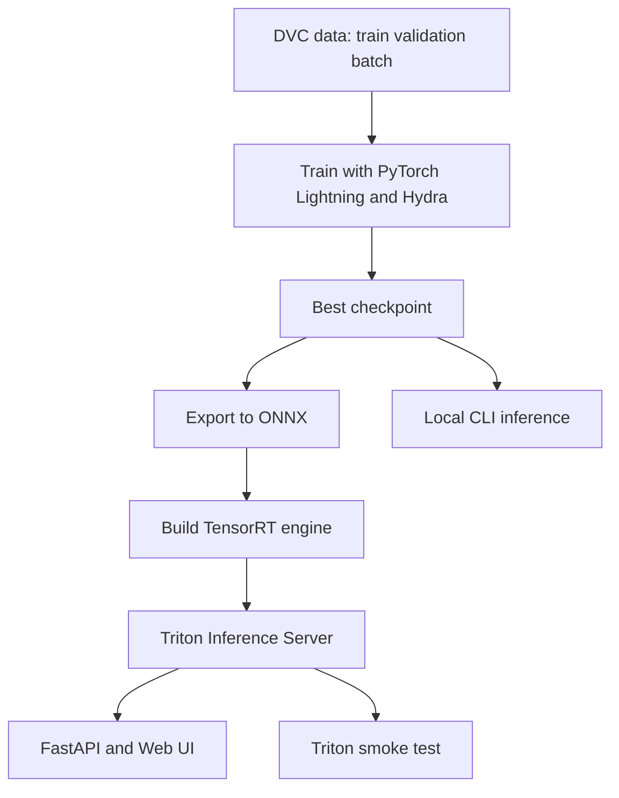

# Children Drawings

Классификация детских рисунков по 4 классам и двум дополнительным целям:

- `category`: `house`, `tree`, `man`, `woman`
- `age`: регрессия возраста
- `gender`: `male`, `female`

## Постановка задачи

Разработка ML-сервиса для автоматического анализа детского рисунка:

1. определить категорию рисунка (4 класса);
2. оценить возраст автора;
3. оценить пол автора.

Потенциальные применения:

- автоматизация анализа в арт-терапии и детской психологии;
- образовательные инструменты мониторинга развития ребенка;
- построение признаков для исследований связи изобразительных навыков и психологических параметров.

## Формат данных

Вход:

- изображение `jpg/jpeg/png` произвольного размера;
- перед моделью изображение приводится к `300x300x3`.

Выход:

- `class` (строка) + `confidence` (float),
- `age` (int),
- `gender` (строка) + `gender_confidence` (float).

## Метрики

Для основной задачи:

- Accuracy (целевой ориентир `> 0.92`);
- Macro F1-score (целевой ориентир `> 0.92`).

Для дополнительных задач:

- age: MAE;
- gender: Accuracy.

В процессе обучения и валидации логируются `loss`, `accuracy`, `f1`, `mae` по головам модели.

## Датасет

Источник: [ironDong/Children_Drawings](https://huggingface.co/datasets/ironDong/Children_Drawings)

Состав:

- Train: ~40k изображений
- Validation: ~4.5k изображений
- Категории: `집 (house)`, `나무 (tree)`, `남자사람 (man)`, `여자사람 (woman)`

Именование изображений в исходном датасете: `[category]_[age]_[gender]_[id].jpg`.

## Моделирование

Бейзлайн (для сравнения):

- предобученный `ResNet-18` как замороженный feature extractor (без fine-tune backbone), обучаются только task heads.

Основная модель:

- `EfficientNet-B3` (ImageNet pretrained, backbone без classifier),
- дообучение слоев с индексом `> 300`, более ранние слои заморожены,
- три головы: `category`, `age`, `gender`.

Тренировочный стек:

- PyTorch Lightning
- Hydra
- MLflow
- DVC

## Валидация

Текущая реализация использует штатное разделение `train/validation` датасета.
Сид фиксирован для воспроизводимости.

## Overall (структура проекта)

Актуальная структура проекта:

```text
.
├── README.md
├── pyproject.toml
├── uv.lock
├── .pre-commit-config.yaml
├── .dvc
│   ├── config
│   └── config.local.example
├── conf
│   ├── config.yaml
│   ├── data
│   ├── export
│   ├── inference
│   ├── logger
│   ├── model
│   ├── paths
│   ├── secret
│   └── training
├── children_drawings
│   ├── api.py
│   ├── data.py
│   ├── evaluate.py
│   ├── exporting.py
│   ├── inference.py
│   ├── model.py
│   ├── prediction.py
│   ├── train.py
│   └── utils.py
├── scripts
│   ├── download.py
│   ├── pull_from_dvc.py
│   └── triton_smoke.py
├── data
│   ├── train.dvc
│   ├── validation.dvc
│   └── batch.dvc
├── artifacts
│   └── onnx_models.dvc
├── models
│   └── children_drawings
│       ├── 1
│       └── config.pbtxt
├── docker
│   ├── Dockerfile.triton-pipeline
│   └── Dockerfile.web
├── compose.yaml
├── plots
└── tests
```

## Пайплайн (обучение -> упаковка -> инференс)

Кратко в шагах:

1. Данные подтягиваются через DVC (`train/validation/batch`).
2. Модель обучается в PyTorch Lightning (конфигурация через Hydra).
3. Лучший checkpoint сохраняется в `artifacts/checkpoints`.
4. Checkpoint экспортируется в ONNX.
5. Из ONNX собирается TensorRT engine (`.plan`) для Triton.
6. Triton поднимается с моделью и используется через API/Web UI/smoke-клиент.



## Setup

Перед `dvc pull` настройте доступы к DVC remote (например, через `.dvc/config.local`
или переменные окружения из раздела "Секреты").

Профили установки (чтобы не скачивать лишнее):

- Только Triton API/Web (без train/CUDA):

```bash
uv sync --no-dev --extra serving
```

- Triton API/Web + DVC (если нужно тянуть артефакты через `dvc pull`):

```bash
uv sync --no-dev --extra serving --extra dvc
```

- Полный ML-пайплайн (train/evaluate/export + DVC):

```bash
uv sync --dev --extra train --extra export --extra dvc
```

- API/Web-сервис для Triton:

```bash
uv sync --no-dev --extra serving
```

Полный стек (всё сразу):

```bash
uv sync --dev --all-extras
uv run pre-commit install
cp .env.example .env
cp .dvc/config.local.example .dvc/config.local
uv run dvc pull data/train.dvc data/validation.dvc data/batch.dvc
```

После копирования проверьте, что в `.dvc/config.local` выставлены ваши креды/профиль для remote.

ВАЖНО: Перед обучением поднимите MLflow:

```bash
sudo docker compose up -d mlflow
```

## Train

1. Установить окружение и подтянуть данные (раздел Setup).
2. Запустить обучение основной модели.
3. При необходимости запустить baseline для сравнения.

Базовый запуск тренировки (`EfficientNet-B3`):

```bash
uv run children-drawings-train
```

Оценка checkpoint:

```bash
uv run children-drawings-evaluate
```

Пример override:

```bash
uv run children-drawings-train training.epochs=5 data.batch_size=16
```

Запуск обучения baseline `ResNet-18`:

```bash
uv run children-drawings-train model.architecture=resnet18_baseline
uv run children-drawings-evaluate model.architecture=resnet18_baseline
```

По умолчанию `training.epochs=30`.

## Logging (MLflow)

MLflow tracking URI: `http://localhost:8080` (по умолчанию, через конфиг).

Логируется:

- метрики обучения/валидации,
- гиперпараметры запуска,
- `git_commit_id` (версия кода запуска),
- `model_architecture` (какая архитектура запускалась: `efficientnet_b3` или `resnet18_baseline`).

<table id="T_b0a5d">
  <caption>Validation comparison (evaluate runs only)</caption>
  <thead>
    <tr>
      <th id="T_b0a5d_level0_col0" class="col_heading level0 col0" >run</th>
      <th id="T_b0a5d_level0_col1" class="col_heading level0 col1" >time</th>
      <th id="T_b0a5d_level0_col2" class="col_heading level0 col2" >model</th>
      <th id="T_b0a5d_level0_col3" class="col_heading level0 col3" >val_f1_cat</th>
      <th id="T_b0a5d_level0_col4" class="col_heading level0 col4" >val_acc_cat</th>
      <th id="T_b0a5d_level0_col5" class="col_heading level0 col5" >val_f1_gender</th>
      <th id="T_b0a5d_level0_col6" class="col_heading level0 col6" >val_mae_age</th>
      <th id="T_b0a5d_level0_col7" class="col_heading level0 col7" >val_loss</th>
    </tr>
  </thead>
  <tbody>
    <tr>
      <td id="T_b0a5d_row0_col0" class="data row0 col0" >14651b42</td>
      <td id="T_b0a5d_row0_col1" class="data row0 col1" >05-24 04:48</td>
      <td id="T_b0a5d_row0_col2" class="data row0 col2" >main (efficientnet_b3)</td>
      <td id="T_b0a5d_row0_col3" class="data row0 col3" >0.9673</td>
      <td id="T_b0a5d_row0_col4" class="data row0 col4" >0.9980</td>
      <td id="T_b0a5d_row0_col5" class="data row0 col5" >0.4138</td>
      <td id="T_b0a5d_row0_col6" class="data row0 col6" >2.2146</td>
      <td id="T_b0a5d_row0_col7" class="data row0 col7" >0.6610</td>
    </tr>
    <tr>
      <td id="T_b0a5d_row1_col0" class="data row1 col0" >47913182</td>
      <td id="T_b0a5d_row1_col1" class="data row1 col1" >05-24 10:57</td>
      <td id="T_b0a5d_row1_col2" class="data row1 col2" >baseline (resnet18)</td>
      <td id="T_b0a5d_row1_col3" class="data row1 col3" >0.8838</td>
      <td id="T_b0a5d_row1_col4" class="data row1 col4" >0.9924</td>
      <td id="T_b0a5d_row1_col5" class="data row1 col5" >0.3724</td>
      <td id="T_b0a5d_row1_col6" class="data row1 col6" >2.2087</td>
      <td id="T_b0a5d_row1_col7" class="data row1 col7" >0.7428</td>
    </tr>
  </tbody>
</table>

Локальный MLflow server:

```bash
sudo docker compose up mlflow
```

Проверка доступности:

```bash
curl -fsS http://localhost:8080/health
```

## Production Preparation

Для экспорта checkpoint в ONNX установите `--extra export` (обычно вместе с
`--extra train`).

1. Экспорт checkpoint в ONNX:

```bash
uv run children-drawings-export
```

ИЛИ

1. Подтянуть ONNX из DVC:

```bash
uv run dvc pull artifacts/onnx_models.dvc
```

2. На целевой машине собрать TensorRT engine (`.plan`) из ONNX:

```bash
sudo docker compose run --rm trtexec-build
```

3. Положить собранный engine в Triton model repository:

```bash
cp artifacts/tensorrt_models/children_drawings.plan models/children_drawings/1/model.plan
```

Готовый `model.plan` не версионируется и не хранится в DVC (т.к. привязан к железу).

Комплект поставки для продакшена:

- `artifacts/onnx_models/children_drawings.onnx` (+ `.onnx.data`);
- `models/children_drawings/config.pbtxt`;
- `models/children_drawings/1/model.plan` (собирается на целевой машине);
- `children_drawings/api.py` и web UI для пользовательского API.

## Данные и модели

Команды `dvc pull` в этом разделе требуют установку `--extra dvc`.

Настроены два remote:

- `r2-storage` — данные (`data/*`)
- `r2-models` — модельные артефакты (`onnx`)

Pull данных:

```bash
uv run dvc pull data/train.dvc data/validation.dvc data/batch.dvc
```

Pull ONNX:

```bash
uv run dvc pull artifacts/onnx_models.dvc
```

Или через вспомогательный CLI:

```bash
uv run python scripts/pull_from_dvc.py onnx
```

Также есть возможность скачать данные напрямую из Hugging Face (для этого нужно указать в .env свой HF токен HF_TOKEN):

```bash
uv run python scripts/download.py download_data --destination_path ./data
```

## Infer / Serving

### Локальный инференс из ONNX (без PyTorch)

Минимальный сценарий после `git clone`:

```bash
uv sync --no-dev --extra onnx-local
uv run children-drawings-onnx-infer inference.images=data/batch/house_image.jpg
```

Если ONNX-артефакты и/или `data/batch` нужно подтягивать автоматически из DVC:

```bash
uv sync --no-dev --extra onnx-local --extra dvc
uv run children-drawings-onnx-infer
```

### Локальный инференс из checkpoint (PyTorch)

Требует установку: `--extra train` (и `--extra dvc`, если хотите авто-pull данных).

Запуск по умолчанию (берет `inference.images=${paths.data_root}/batch`):

```bash
uv run children-drawings-infer
```

Запуск по конкретному файлу:

```bash
uv run children-drawings-infer inference.images=data/batch/house_image.jpg
```

Запуск с override checkpoint:

```bash
uv run children-drawings-infer inference.checkpoint=artifacts/checkpoints/best.ckpt
```

Формат входа:

- путь к одному изображению (`.jpg/.jpeg/.png`) или директории с изображениями;
- если путь к DVC-сплиту отсутствует локально, данные подтягиваются автоматически.

Пример вывода:

```json
{
  "class": "house",
  "confidence": 0.97,
  "age": 8,
  "gender": "female",
  "gender_confidence": 0.93,
  "image": "house_image.jpg"
}
```

### Triton + TensorRT (серверный инференс)

Требует установку: `--extra serving`.

Поднять Triton:

```bash
sudo docker compose up triton-pipeline
```

Smoke-клиент к Triton:

```bash
uv run python scripts/triton_smoke.py
```

Web-сервис (загрузка файлов + canvas-рисование):

```bash
sudo docker compose up triton-pipeline web-app
```

Важно: инференс/экспорт в этом сервисе выполняется только для основной модели
`EfficientNet-B3`. Baseline `ResNet-18` используется только как контрольный
вариант в train/evaluate.

Endpoints:

- Web UI: `http://localhost:8200`
- Triton HTTP: `http://localhost:8100`
- Triton gRPC: `localhost:8101`
- Triton metrics: `http://localhost:8102/metrics`

## Checks

```bash
uv run pre-commit run -a
uv run ruff check .
uv run ruff format --check .
uv run pytest
```

## Секреты

Не храните ключи в Git.

Рекомендуемый подход:

1. коммитить только `.dvc/config` и `.dvc/config.local.example`;
2. реальные ключи держать в `.dvc/config.local` (gitignored) или в CI secrets;
3. для локального запуска использовать переменные окружения:
   - `R2_ACCESS_KEY_ID`
   - `R2_SECRET_ACCESS_KEY`.
